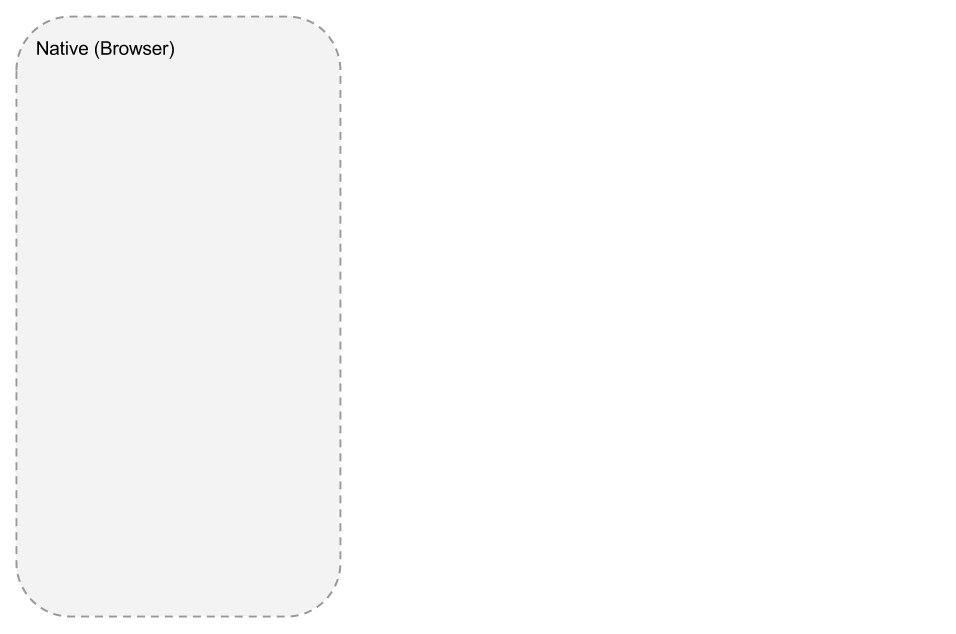
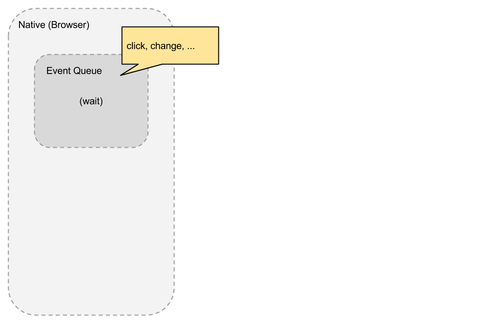
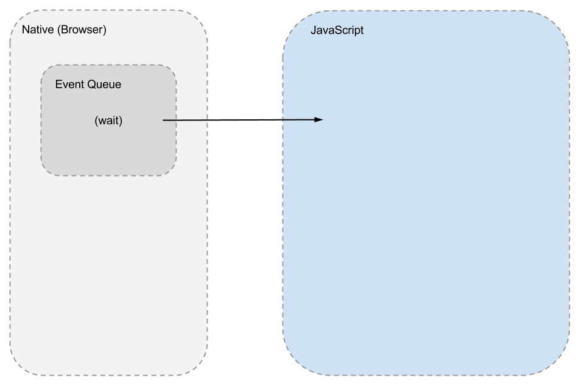
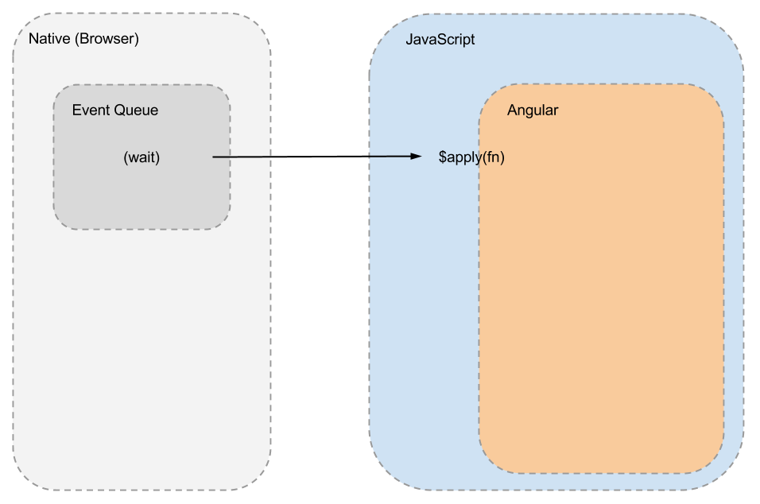
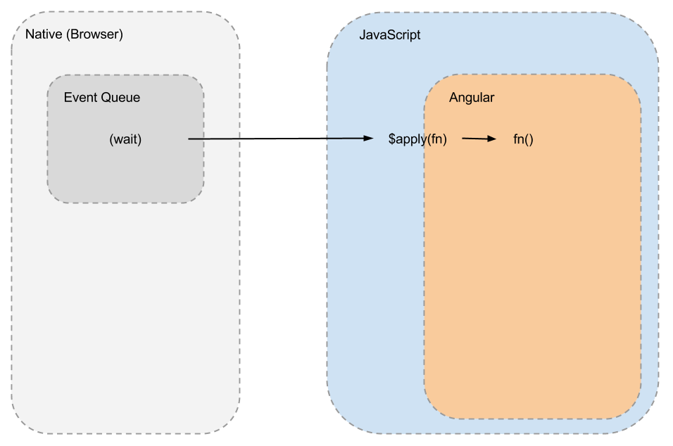
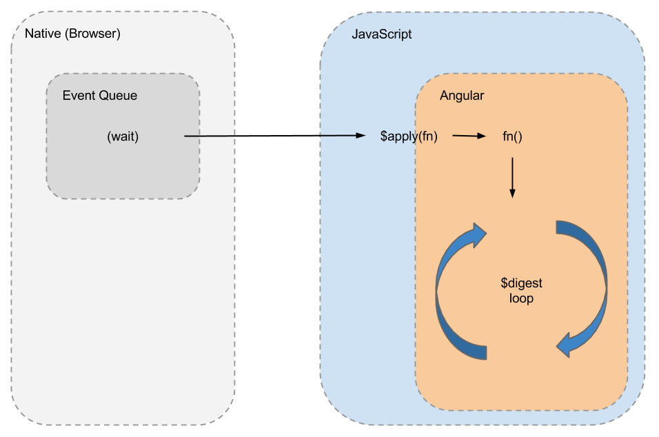
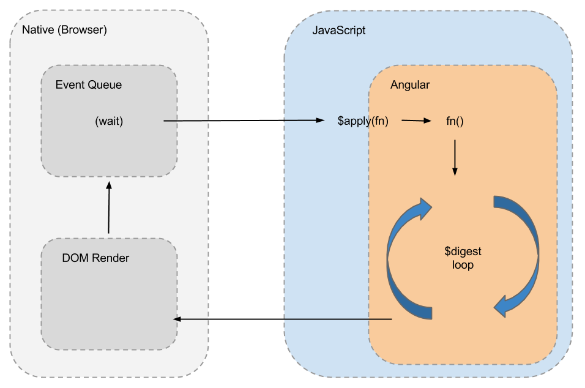

# *__AngularJS__*
### in one day


---


* @toddmotto
* Lead Engineer @ Mozio
* Google Developer Expert
* 2.5+ years Angular exp.
* AngularJS styleguide
* Blog at toddmotto.com

---

# Workshop

* _09:30-11:00_: Angular concepts/APIs/overview
* _11:25-12:55_: Source code walkthrough/talk
* _14:25-15:55_: Dev tasks/discussions/Q&A
* _16:20-17:50_: Dev tasks/discussions/Q&A

---

# Outcomes

* Deeper understanding of software practices Angular is built/inspired by
* Annotated source code of important aspects of the app
* Best practices and architecture/structure knowledge
* Working application based on tasks

---

# *__Intros!__*


---

# Intros: over to you!

* Name and where you're from
* Your development experience
* Experience with Angular

---

### Getting started


---

# [fit] Don't learn the framework 
# [fit] learn the concepts
# [fit] and apply them

---

# *__Single Page Apps__*


---

# Routing

* Dynamic routes and views
* XHR templates
* App state driven by URL

---

# MVC + data-binding

* Model
* View
* Controller
* Two way data-binding

---

# Model

* Source of truth
* Data structure
* Architecture
* JSON

---

# View

* Components/HTML
* Rendered output
* Model expressed as UI

---

# Controller

* Drives Model and View changes
* Specific roles for UI/components

---

# Two way data-binding

* Binds DOM to JS models
* Keeps data in sync
* Model changes drive View changes
* View changes drive Model changes

---

# *__Angular overview__*
### Top level APIs


---

# Directives

* Reusable UI components
* Optionally "isolate" scoped (encapsulation)
* "Web Components"
  * ShadowDOM
  * HTML imports
  * Templating
  * Custom elements

---

# Directives

```js
function fileUpload() {
  return {
    scope: {},
    replace: true,
    template: [
      '<div>Upload template!</div>'
    ].join(''),
    controller: function () {...}
  };
}

angular.module('app').directive('fileUpload', fileUpload);
```

---

# Services

* Singletons, act as Constructors
* Use the "this" keyword

---

# Services

```js
function UploadService($http) {
  function uploadFile() {
    // logic
  }
  this.uploadFile = uploadFile;
}

angular.module('app').service('UploadService', UploadService);
```

---

# Factory

* Singletons
* Return closures/Objects
* Ability to run code before closure is returned
* A "Factory" is just a Service
* Suffix Factories with "Service"
* The only difference is how you want to build

---

# Factory

```js
function AuthService($http) {
  var privateVar = 'someValue';
  function checkAuth($http) {
    // logic
  }
  return {
    checkAuth: checkAuth
  };
}

angular.module('app').factory('AuthService', AuthService);
```

---

# Filters

* Manipulating data on-the-fly
* Types of filters
  * Single value (such as a date)
  * Multiple values (such as ng-repeat)
* Multiple ways to create them

---

# Filters

```html
<!-- filter on single value -->
<p>{{ vm.date | date: 'dd-MM-yyyy' }}</p>

<!-- filter on a repeat -->
<ul>
  <li ng-repeat="user in vm.users | filter:searchTerm">
    {{ user.name }}
  </li>
</ul>
```

---

# *__Angular overview__*
### Digging into the core


---

# Built-in Directives

* ng-* attributes (internal directives)
* Extend HTML's capabilities
* Delegate DOM manipulation for you

---

# Built-in Directives

```html
<button type="submit" ng-click="vm.submitForm();">
	Submit!
</button>

<div ng-show="vm.userValid">Show if valid!</div>
```

---

# Expressions

* Angular's handlebar implementation
* Powerful expression parsers
* Javascript-like operators
* Evaluate against truthy/falsy values

---

# Expressions

```html
<p>{{ vm.user.name }}</p>

<p>{{ vm.authorised ? 'Welcome' : 'Please login' }}</p>
```

---

# Form validation

* Automatic state-driven form validation
* Integrate with custom errors
  * Such as ngMessage/ngMessages
* Easily handle form submissions based on $error states

---

# Form validation

```html
<form name="myForm" ng-submit="vm.onSubmit();">
  <input 
    type="text"
    name="username"
    required="" 
    ng-model="vm.username">
  {{ myForm.username.$error | json }}
  <button type="submit">
    Submit
  </button>
</form>
```

---

# Routing

* Dynamic routes and views (ng-view or ui-view)
* XHR templates
* App state driven by URL

---

# Routing

```js
function router($stateProvider) {
  $stateProvider
    .state('parent', { abstract: true, template: '<ui-view/>' })
    .state('parent.inbox', {
      url: '/inbox',
      views: {
        '@': {
          templateUrl: 'partials/inbox.html',
          controller: 'InboxCtrl as vm'
        }
      }
    });
};

angular.module('app').config(router);
```

---

# Dependency Injection

* Tell Angular what dependencies you want
* Automatically injected as function arguments
* Minification-safe arguments using $inject
  * ng-annotate for automation

---

# Dependency Injection

```js
function AuthService($scope, $rootScope) {
  // service logic
}

AuthService.$inject = ['$scope', '$rootScope'];

angular.module('app').controller('AuthService', AuthService);
```

---

# *__Programming utilities__*


---

# Programming utilities

* Check out existing utility methods available
  * docs.angularjs.org/api/ng/function

---

# Programming utilities

```js
// Function.prototype.bind
angular.bind(self, fn, args);

// Manual bootstrapping (such as after async loading)
angular.bootstrap(document, ['tm.workshop']);

// Deep copy of the source Object/Array
angular.copy(source, [destination]);

// Array.prototype.forEach
angular.forEach(obj, iterator, [context]);

// Array.isArray
angular.isArray(value);

// ...and many more!
```

---

# *__$digest loop__*


---

# $digest: *__$digest loop__*

* High level Object for dirty-checking values
* Each $scope has a $watchers Array that stores binding callbacks
* Two-way binding is kept updated through the $digest cycle
* Triggered by internal events/$scope.$apply (e.g. ng-click)

---

# $digest: *__$$watchers__*

* View events/bindings {{ foo }}
* Angular adds a watch to the $watch list
* Only $watched if bound in the View
* Dirty checked in the $digest loop
* Minimise use of $$watchers / avoid if possible

---



---



---



---



---



---



---


---



---

# *__Complete__*
### Questions/discussion?


---

# Workshop Application

github.com/toddmotto/ngWorkshop2015

```vim
cd ngWorkshop2015/app/
python -m SimpleHTTPServer
```

* Notes for windows machines:
  * If seeing issues, use the root directory

---

# Workshop tasks

---

## Render the emails

* JSON files
* Controllers/Services
* Directives

---

## Unread class name

* Unread class:
  * "message--unread"
  * Add to root element: <div class="message cf">
* Must be data-bound

---

## Order by unread emails

* Make unread emails appear at the top of the ng-repeat

---

## "X of 121" emails count a live count

* Make only "X" a live count, not 121

---

## Setup search filter whilst typing

* Use search input at the top to create search whilst the user types

---

## "Trash" all checked emails

* Each email has a checkbox, when checked it can be deleted
* Using the trash icon at the top of the Inbox view to bind that functionality to
* Doesn't need to make a POST request but needs to update the UI

---

## Update unread counter

* Unread counter in the sidebar
* Data-bound to reflect updates made by Trashing item(s)

---

## Open email send preview

* <tm-new-email></tm-new-email>
* <tm-compose></tm-compose>

---

## Add ngMessages validation

* ngMessages module is included
* Add custom validation messages to:
  * To:
  * Subject:
  * Message:

---

## Write an example POST method in the EmailService and bind to compose new email submit

* Files: tmCompose.js, tmCompose.html
* Submit function that calls the EmailService API
  * Add a "deleteEmail" method
